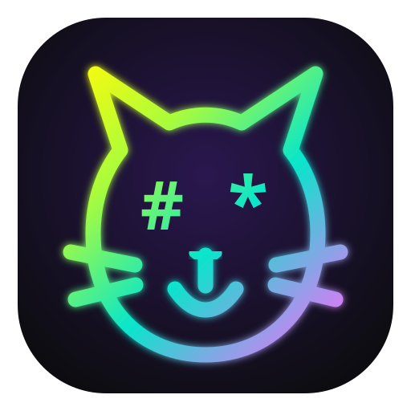

<div align="center">



# ScribeCat

**A clean, self-hosted WYSIWYG Markdown editor.**  
**Plain files, no subscription, no proprietary document format, no AI layer.**

</div>

ScribeCat is a streamlined Markdown writing environment for people who want the comfort of a visual editor without giving up ordinary files.

Notes stay as normal `.md` files in a normal folder. Images use relative Markdown paths, tags live in YAML frontmatter, diary entries are ordinary Markdown files, and tasks are ordinary Markdown checklists. The vault remains readable and editable outside ScribeCat.

## Feature overview

### WYSIWYG Markdown editor

ScribeCat edits Markdown through a visual writing surface while keeping Markdown as the source of truth.

The editor supports:

- Headings
- Bold, italic, underline and strikethrough
- Highlight/marker text
- Bullet lists
- Numbered lists
- Checkbox/task lists
- Blockquotes
- Inline code
- Code blocks
- Links
- Images
- Callouts
- Tables
- Undo and redo
- Paste-as-Markdown
- Search and replace
- Full-document and vault-wide search
- Keyboard navigation and customizable shortcuts
- Compact and full-width writing layouts
- Zen mode with text zoom
- Optional automatic heading numbering
- Live document outline in the Details panel

Tables can be edited visually, including adding and removing rows and columns.

### Plain files and portable storage

ScribeCat deliberately avoids a proprietary note database.

- Notes are ordinary Markdown files
- Folders are ordinary filesystem folders
- Markdown links remain normal relative links
- Images are stored in note-local `_attachments/` folders
- Tags are stored in YAML frontmatter
- Diary entries use ordinary Markdown files
- Tasks use ordinary Markdown checkbox lines
- Vault-specific settings are stored in small `.scribecat/` metadata files
- The library can still be opened with other Markdown tools

Example:

```text
Notes/
├── Projects/
│   ├── Plan.md
│   └── _attachments/
│       └── sketch.jpg
├── Dagbok/
├── Gjøremål/
└── .scribecat/
```

A normal image reference stays portable:

```markdown

```

### Start, files and folders

The Start view gives quick access to the main workspace and the dedicated Calendar, Graph and Tasks views.

File and folder features include:

- File tree navigation
- Folder grid/collection view
- New note
- New folder
- Rename
- Move
- Duplicate
- Delete from context menus and selection actions
- Multi-select for moving or deleting several items
- Manual, name and modified-date sorting
- Drag-and-drop organization
- Collapse all open folders
- Folder notes
- Custom emoji icons for files and folders
- Open folders in the system file manager on supported desktop platforms
- Import files and folders
- Download Markdown
- Download folder archives as ZIP
- Recent folders
- A persistent “In progress” / working-set list for notes you want to keep at hand

### Portable tags

ScribeCat supports multiple tags per note. Tags are edited in the Details panel and stored directly in YAML frontmatter:

```markdown
---
tags:
  - "project"
  - "important"
  - "work"
---

# My note
```

The YAML metadata stays hidden from the WYSIWYG writing surface and from rendered exports while remaining part of the original Markdown file.

The sidebar includes a tag overview with counts. Selecting a tag opens matching notes.

Diary tags and task tags are also stored in the underlying Markdown and can be filtered from their dedicated views.

### Graph view

The global Graph view is generated directly from the vault's existing Markdown data.

It builds relationships from:

- Normal Markdown links between notes
- YAML tags
- Folder placement

The graph includes separate visual node types for notes, tags and folders.

You can:

- Pan and zoom
- Drag nodes
- Fit the graph to the window
- Focus a node and its direct connections
- Open notes, tags and folders directly from the graph
- Toggle notes, tags and folders independently
- Refresh the graph
- Work with an organic bubble-style layout that separates unrelated groups

There is no graph database and no proprietary link syntax.

### Diary / Calendar

ScribeCat includes a Markdown-first daily diary with a calendar interface.

Features include:

- Calendar navigation by month and year
- Direct opening/creation of a day
- No future-day navigation
- Year selection back to 1900, or earlier when imported diary entries require it
- Previous-day and next-day navigation
- Diary overview
- Full-text diary search
- Tag filtering
- Per-day YAML tags
- Automatic detection of existing diary Markdown files
- Configurable diary folder
- Configurable date/file structure
- Option to hide the diary storage folder from the normal file and tag views
- Right-click deletion of diary entries from overview/search results

The diary note field is always editable and grows automatically with the amount of text.

#### Diary images

Diary entries can contain an image gallery stored as ordinary Markdown references.

The gallery supports:

- Multiple image selection
- Drag-and-drop image import
- Masonry-style layout
- Drag-and-drop reordering
- Full-screen preview
- Previous/next navigation
- Keyboard arrow navigation
- Horizontal swipe navigation on touch devices
- Right-click image deletion

When an image reference is removed, the attachment file is deleted from disk only if no other Markdown file still references it. Shared images are therefore preserved.

### Tasks

ScribeCat includes a dedicated Markdown-first Tasks view.

Task categories are stored as one Markdown file per category under:

```text
Gjøremål/
├── Jobb.md
├── Fritid.md
└── Uten kategori.md
```

Plain Markdown checkboxes are detected automatically:

```markdown
# Jobb

- [ ] Send report 📅 2026-10-01
- [x] Book meeting room
```

Tasks support:

- Optional category
- Optional deadline
- Optional note
- Tags
- One-level subtasks stored as ordinary indented Markdown checkboxes
- A collapsible **Completed** section below active tasks
- Three priority levels
  - Red / high
  - Yellow / medium
  - Green / low
- Check/uncheck
- Inline text editing
- Deadline editing
- Task deletion
- Category filtering
- Tag filtering
- Category rename
- Category deletion with ScribeCat's normal confirmation dialog
- Drag-and-drop movement between categories
- Priority-first sorting for open tasks, followed by deadline

Deadline views include:

- Today
- This week
- This month
- Next month

The task creation form is opened from **New task** on desktop and a compact **+** action on phones.

The `Gjøremål/` storage folder can be hidden from the normal file tree and tag overview through the open-folder settings without deleting or changing the Markdown files.

### Images in normal notes

Images inserted in normal notes use relative Markdown paths and local attachment files.

Features include:

- Image picker
- Paste/import support
- Full-screen preview
- Touch-friendly viewing
- Right-click **Delete image**
- Safe orphan cleanup

Deleting an image removes the Markdown reference first. The physical attachment is removed only when no other saved or currently open unsaved Markdown document still references it.

External image URLs are never deleted from local storage.

### Search and replace

ScribeCat supports:

- Search inside the current document
- Replace in the current document
- Vault-wide search
- Vault-wide replace with review/confirmation
- Match counts
- Case-sensitive search
- Whole-word search
- Folder result badges
- Search without needing an open note

Diary search is separate and understands diary dates, text and tags.

### Auto-save, drafts and conflict protection

Auto-save is enabled by default for new installations and can be changed under **Settings → General**.

ScribeCat also includes:

- Draft recovery / hot exit
- Unsaved edits surviving restarts
- Per-vault working-set restoration
- Save-time conflict detection
- Protection against silently overwriting externally modified files
- Disk-version preservation in history before a manual overwrite

### Version history

Version history can be enabled for the vault.

When enabled:

- Previous file contents are stored before changed files are saved
- Unchanged saves do not create duplicate versions
- A configurable number of versions can be retained per file
- Old versions can be viewed and compared with the current document
- Versions can be restored
- Stored history can be cleared from Settings

History is stored inside the vault under `.scribecat/`.

### Document locking

A note can be locked against accidental editing.

Locks are stored with the vault in:

```text
.scribecat/document-locks.json
```

This means a note locked on one device also opens locked on another device using the same vault.

Locks follow notes when they are renamed or moved. Locked notes remain readable and searchable.

### Export and print

ScribeCat keeps the original Markdown file intact while also supporting rendered output workflows such as:

- Print
- PDF
- DOCX
- HTML
- Markdown download
- Folder ZIP download
- Manuscript-oriented export

YAML metadata is not shown in rendered exports.

### Keyboard shortcuts

Keyboard shortcuts are customizable.

You can:

- Change shortcuts
- Disable individual shortcuts
- Reset one shortcut
- Reset all shortcuts

Shortcuts cover application actions, formatting, lists, headings, links, navigation, zoom, dictation, details-panel visibility and more.

### Mobile and touch support

ScribeCat is designed to remain usable on phones and tablets.

Touch-focused features include:

- Mobile file sidebar
- Edge swipe to open/close the file list
- Large calendar controls
- Phone-specific diary navigation
- Swipe navigation between diary images
- Touch-friendly multi-select
- Image picker support
- Mobile Start shortcuts for Calendar, Graph and Tasks
- Calendar, Graph and Tasks shortcuts inside the mobile sidebar
- Responsive Tasks filters and category navigation

### Appearance and layout

ScribeCat includes:

- Light and dark appearance
- Paper-white option for dark mode
- Compact or full-width documents
- Hide/show file sidebar
- Zen mode
- Adjustable text zoom
- Responsive desktop, tablet and phone layouts

### Offline dictation

Local offline dictation is available as a normal writing feature and runs on the device with `whisper.cpp`.

It does not use an AI writing service or send text to a hosted model provider.

### Settings

Settings are grouped into clearer sections for application-wide and vault-specific behavior.

Open-folder settings include separate groups for:

- Document
- Diary
- File list
- Folders

Vault settings include options such as:

- Heading numbering
- Folder notes
- Diary folder and date structure
- Hide diary storage from the normal file list
- Hide Tasks storage from the normal file list

Other settings cover appearance, editor behavior, shortcuts, versioning, account/server settings and related application preferences.

### Server edition

ScribeCat Server Edition provides browser access to an ordinary filesystem-backed vault.

It supports:

- Self-hosted web access
- Docker deployment
- NAS bind mounts
- Full file API
- Live updates
- Authentication
- Signed-in device management
- Server certificate information
- Remote vault connections from supported ScribeCat clients

Server setup and connected-server management live under **Settings → Server**.

Account controls live under **Settings → Account**, including password management, signed-in devices and sign out.

Example Docker Compose setup:

```yaml
services:
  scribecat:
    image: ghcr.io/reidar96/scribecat-server:latest
    container_name: ScribeCat
    ports:
      - 8117:3000
    volumes:
      - /volume1/notes:/data:rw
    environment:
      TZ: Europe/Oslo
      PUID: 0
      PGID: 0
      SCRIBECAT_INIT_PASSWORD: "CHANGE-ME"
      SCRIBECAT_VAULT_PATH: /data
      SCRIBECAT_HOST: 0.0.0.0
      SCRIBECAT_PORT: 3000
      SCRIBECAT_COOKIE_SECURE: "false"
      SCRIBECAT_TRUST_PROXY: "false"
    restart: unless-stopped
```

For a first start, use a strong password and remove `SCRIBECAT_INIT_PASSWORD` from the Compose file after the server has initialized its authentication data.

Versioned Docker images are published alongside `latest`, for example:

```text
ghcr.io/reidar96/scribecat-server:0.22.5
```

### Languages

English is the default language for a new installation.

Norwegian Bokmål is included as a complete interface option, and the other bundled interface languages are retained.

## What ScribeCat intentionally leaves out

All AI writing tools and AI integrations from the upstream project have been removed from ScribeCat.

There is no:

- AI assistant
- AI rewriting
- Agent chat
- Model selector
- Knowledge-base AI
- Model-provider configuration
- LLM proxy
- AI credential storage
- AI OCR

Local offline dictation remains because it is a direct device-side writing feature rather than an AI writing/integration layer.

The built-in ScribeCat-managed spellcheck system has also been removed.

The goal is a quieter writing tool: open a folder, write, organize, search, use the calendar/tasks/graph views when useful, and keep the files yours.

## Development

Check the web frontend with:

```bash
npm ci
npm run build:web
```

Check the server with:

```bash
cd server
npm ci
npm run build
```

The Docker server image is built from `server/Dockerfile`.

## Origin and license

ScribeCat is based on **ScribeDog**, created by the ScribeDog project and distributed under the MIT License.

ScribeCat is an independent streamlined adaptation and is not presented as the upstream ScribeDog project.

The original copyright and MIT license are preserved in [LICENSE](LICENSE). Third-party notices remain in [THIRD_PARTY_LICENSES.md](THIRD_PARTY_LICENSES.md).

ScribeDog upstream: https://github.com/snooky234/scribedog
