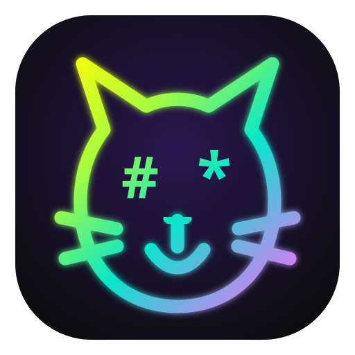
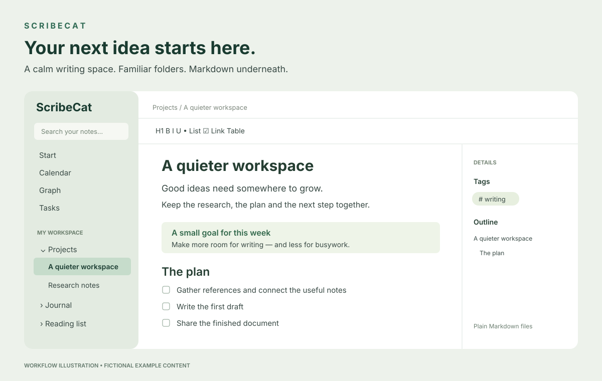
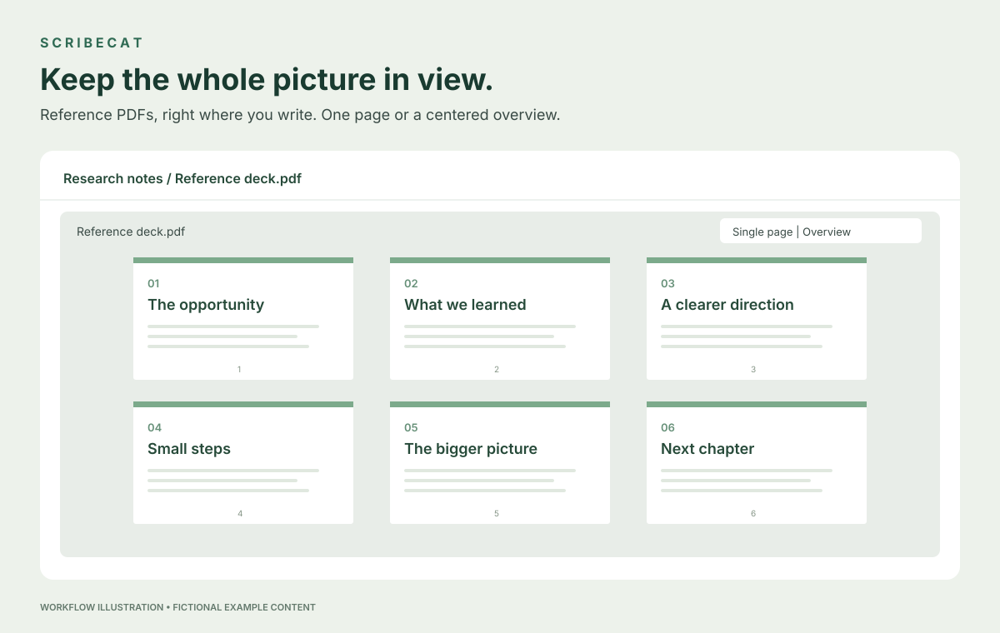
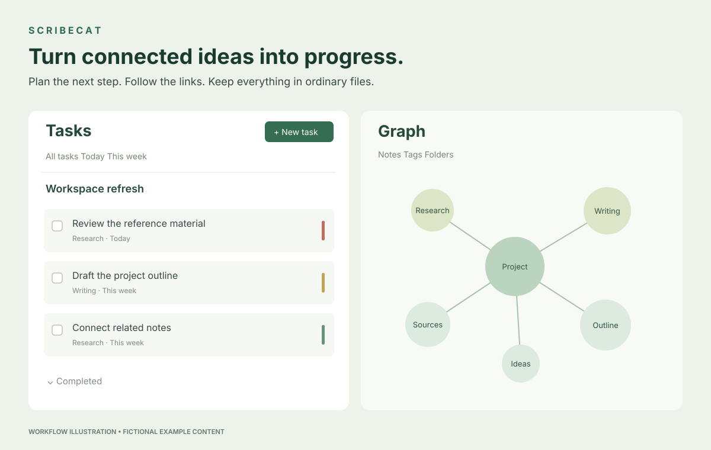

<div align="center">



# ScribeCat

### A home for your notes. A clear view of your day. Files that stay yours.

Write beautifully, connect your ideas, and turn plans into progress — in a visual Markdown workspace you can run on your own computer or server.

**Open source · Ordinary Markdown files · Windows & Linux · Self-hosted web app**

[**Download ScribeCat**](https://github.com/Reidar96/scribecat/releases/latest) · [**Self-host with Docker**](server/README.md) · [Explore the features](docs/features.md) · [What's new](CHANGELOG.md)

</div>



*Interface illustration with fictional example content, not a captured application screenshot. The illustrations below explain existing workflows; exact layout varies by device and settings.*

## Make room for your next idea

ScribeCat brings notes, a daily journal, tasks and connected ideas into one calm workspace. Format a document without wrestling with Markdown syntax. Keep reference PDFs close to your writing. Find the note you need with search, tags or a visual graph.

Underneath it all, your work remains ordinary files in ordinary folders. Use another editor, back up your vault with your own tools, or move it to another machine. Your writing does not depend on a proprietary document format or a subscription.

## One workspace, many ways to get things done

| What you want to do | How ScribeCat helps |
| --- | --- |
| **Write without friction** | Visual Markdown editing with tables, images, callouts, code blocks and checklists. Switch to Zen mode when you want room to focus. |
| **Keep projects within reach** | Organize folders, add portable tags, search across your vault and keep active notes in your working set. |
| **Read while you write** | View PDFs inside notes, zoom in on a page, or browse a centered multi-page overview with two or three columns. |
| **Remember your days** | Open a date in the calendar, write a journal entry and add a photo gallery. Entries remain Markdown files. |
| **Move plans forward** | Manage tasks with categories, deadlines, priorities, tags and subtasks — stored as Markdown checkboxes. |
| **See the connections** | Explore a graph built from note links, tags and folders. Follow a connection straight back to the relevant note. |
| **Return with confidence** | Auto-save, draft recovery and save-time conflict checks help protect your work. Enable version history to compare and restore earlier versions. |
| **Share finished work** | Export to PDF, DOCX or HTML, print a document, or download Markdown and folder archives. |

## From reference material to finished writing



*Illustrated PDF workflow with sample pages.* Keep reference material in your writing environment, switch between a single page and an overview, and use fullscreen when you need more room.

## Your tasks and ideas belong together



*Illustrated task and graph workflows with fictional content.* Turn a project into manageable steps, then use links and tags to keep the surrounding research connected.

## Choose where your workspace lives

### On your computer

Download the latest release, open a folder and start writing. The desktop app works with local files and can also connect to a ScribeCat server vault.

| Platform | Available downloads |
| --- | --- |
| Windows | Installer (`.exe`), MSI and portable ZIP |
| Linux | AppImage, Debian package and RPM |

[**Get the latest desktop release →**](https://github.com/Reidar96/scribecat/releases/latest)

### On your own server

Run ScribeCat with Docker and access your vault through a browser on your computer, tablet or phone. Store your notes on your own server or NAS, with password sign-in and session management.

The supplied Compose setup includes Caddy for HTTPS. From a checkout:

```bash
cd server
cp .env.example .env
# Edit .env: set a strong initial password and your deployment settings.
docker compose up -d
```

Follow the [server setup guide](server/docs/getting-started.md) for hostname, certificate and first-sign-in instructions. Docker releases use explicit version tags, such as `ghcr.io/reidar96/scribecat-server:0.26.0`; there is no moving `latest` tag.

**Desktop and web share the same core workspace.** The web edition uses your server's storage; local offline dictation is a desktop feature. Phone and tablet access is through the responsive web app, not a separate native mobile release.

## Built around files you can keep

- **Markdown at the core.** Notes and diary entries are `.md` files; tasks are checkboxes; tags live in YAML frontmatter.
- **Portable attachments.** Local images use relative paths and note-local attachment folders.
- **Your own storage.** Work locally or host the server yourself. Bring your own backups.
- **A focused writing experience.** No AI writing assistant or model-provider setup. Optional desktop dictation runs locally with `whisper.cpp`.
- **Make it comfortable.** Light and dark appearance, adjustable text size, customizable shortcuts, and English or Norwegian Bokmål interface options among the bundled languages.

ScribeCat is actively developed. See the [changelog](CHANGELOG.md) for release details and [report a bug](https://github.com/Reidar96/scribecat/issues) if something gets in your way.

## Explore further

- [Complete feature guide](docs/features.md)
- [Self-hosting and server documentation](server/docs/README.md)
- [Security policy](SECURITY.md)
- [Releases and downloads](https://github.com/Reidar96/scribecat/releases)

## Development

```bash
npm ci
npm test
npm run build:web
```

For the server:

```bash
cd server
npm ci
npm test
npm run build
```

The desktop app uses Tauri; the web client uses React and TypeScript. See the [server development guide](server/docs/development.md) for the local web workflow. The Docker image is built from `server/Dockerfile`.

## Origin and license

ScribeCat is an independent adaptation of [ScribeDog](https://github.com/snooky234/scribedog), distributed under the **MIT License**. The original copyright and license are preserved in [LICENSE](LICENSE); third-party notices are in [THIRD_PARTY_LICENSES.md](THIRD_PARTY_LICENSES.md).
